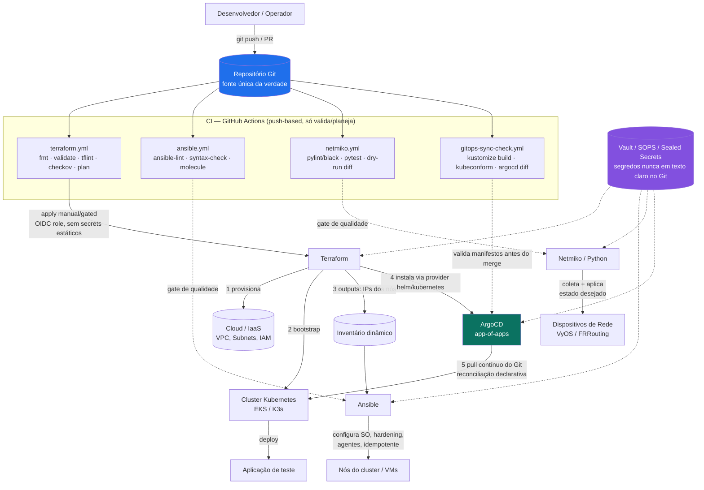

# PoC — Esteira GitOps Ponta a Ponta (Terraform + Ansible + Netmiko + ArgoCD)

PoC compacta e funcional demonstrando a integração de 4 camadas de automação sob
um único modelo operacional **GitOps**: o Git é a única fonte de verdade, os
pipelines de CI fazem apenas **validação/planejamento** (push-based, restrito),
e o **estado real** (Kubernetes) é convergido de forma contínua e pull-based
por um controlador (ArgoCD) — enquanto Terraform, Ansible e Netmiko cobrem as
camadas que ArgoCD não alcança: nuvem, SO dos nós e rede física/virtual.

## 1. Arquitetura da Solução

### 1.1 Diagrama de fluxo



### 1.2 Divisão de responsabilidades (tradeoffs)

| Camada | Ferramenta | Responsabilidade | Por que essa ferramenta (e não outra) |
|---|---|---|---|
| Cloud/IaaS + bootstrap do cluster | **Terraform** | Cria VPC, subnets, IAM, node groups e o cluster K8s (EKS) e instala o ArgoCD via provider `helm`/`kubernetes` | Modelo declarativo com state file e grafo de dependências; é o único ponto que sabe criar/destruir recursos de nuvem. Não é usado para *configurar* SO (não é idempotente para isso) nem para gerenciar objetos K8s de aplicação (perderia o loop de reconciliação contínua que o GitOps exige) |
| SO / agentes dos nós | **Ansible** | Hardening de SO, usuários, pacotes base, agente de monitoramento (node_exporter), agente de segurança (auditd) | Agentless (SSH), idempotente por design, modelo de *roles* reutilizável. Terraform poderia rodar `remote-exec`, mas isso acopla infraestrutura e configuração e quebra idempotência real |
| Rede (switches/roteadores) | **Netmiko** | Coleta de estado (`show run`), comparação com estado desejado (templates Jinja2) e aplicação do diff | Dispositivos de rede tradicionais não expõem Terraform providers maduros nem Ansible de forma universal; Netmiko dá controle fino via CLI/SSH, essencial em ambientes multi-vendor. Ansible poderia orquestrar o *quando*, mas a lógica de diff/push fica no script Python |
| Estado do Kubernetes (aplicações) | **ArgoCD (GitOps)** | Reconciliação contínua *pull-based* do estado declarado no Git | CI (push-based) não deveria ter credenciais de `kubectl apply` em produção — risco de segurança e de drift silencioso. ArgoCD fecha o loop: qualquer alteração manual no cluster é revertida automaticamente para o estado do Git |
| CI | **GitHub Actions** | Apenas *lint/validate/plan/diff* — nunca `apply` direto em produção sem gate manual, e nunca `kubectl apply` | Reduz a superfície de ataque: pipelines de CI não guardam credenciais amplas de cluster; a única entidade com permissão de escrita no cluster é o controlador ArgoCD rodando dentro dele |
| Segredos | **Vault + SOPS + Sealed Secrets** | Vault: credenciais dinâmicas de rede/cloud. SOPS: `terraform.tfvars`/`ansible-vault`. Sealed Secrets: segredos de aplicação versionáveis no Git | Nenhum segredo em texto claro no Git em nenhuma camada; cada ferramenta usa o mecanismo nativo ao seu ecossistema em vez de um cofre genérico mal integrado |

## 2. Estrutura do Repositório (Monorepo)

Optamos por **monorepo** nesta PoC: menor overhead operacional, versionamento
atômico entre camadas correlatas (ex.: um PR muda o módulo EKS e o manifesto
ArgoCD que depende dele) e um único pipeline de PR review. Em escala de
produção multi-time, a recomendação é dividir em **multirepo** por domínio
(`infra-terraform`, `infra-ansible`, `net-automation`, `gitops-manifests`),
mantendo este monorepo como referência de padrão.

```
poc-gitops/
├── README.md
├── terraform/
│   ├── environments/aws/           # ambiente alvo (main.tf, backend remoto)
│   ├── modules/vpc/                # rede da cloud
│   ├── modules/eks/                # cluster K8s gerenciado
│   └── modules/bootstrap/          # provider helm/kubernetes -> instala ArgoCD
├── ansible/
│   ├── inventory/                  # inventário (dinâmico aws_ec2 ou estático)
│   ├── group_vars/                 # variáveis por grupo (vault-encrypted p/ secrets)
│   ├── roles/
│   │   ├── baseline/                # hardening + estado base do SO
│   │   ├── security_hardening/      # CIS-like: ssh, ufw, auditd
│   │   └── monitoring_agent/        # node_exporter
│   └── playbook.yml
├── netmiko/
│   ├── network_state_manager.py    # coleta + aplica estado (idempotente)
│   ├── inventory.yaml              # dispositivos + estado desejado
│   ├── templates/interface.j2      # templates Jinja2 de config
│   └── requirements.txt
├── kubernetes/
│   ├── argocd/bootstrap/           # app-of-apps (root Application)
│   ├── argocd/apps/                # 1 Application por app real
│   ├── manifests/sample-app/       # deployment/service/kustomization
│   └── sealed-secrets/             # exemplo de segredo selado
├── .github/workflows/
│   ├── terraform.yml
│   ├── ansible.yml
│   ├── netmiko.yml
│   └── gitops-sync-check.yml
└── docs/
    └── secrets-management.md
```

## 3. Guia de Execução e Validação

### 3.1 Pré-requisitos
```bash
terraform -version   # >= 1.7
ansible --version    # >= 2.16
python3 -m pip install -r netmiko/requirements.txt
kubectl version --client
argocd version --client
kubeseal --version   # sealed-secrets CLI
```

### 3.2 Passo a passo (bootstrap completo)

**Camada 1 — Infraestrutura + Cluster (Terraform)**
```bash
cd terraform/environments/aws
terraform init -backend-config=backend.hcl
terraform plan -out=tfplan
terraform apply tfplan
# outputs: cluster_endpoint, node_ips, argocd_admin_password (via Vault, ver docs/secrets-management.md)
aws eks update-kubeconfig --name poc-gitops --region us-east-1
```
**Validação:**
```bash
terraform validate
terraform plan -detailed-exitcode   # 0 = sem drift, 2 = drift detectado
kubectl get nodes
kubectl -n argocd get pods
```

**Camada 2 — Baseline do SO (Ansible)**
```bash
cd ansible
ansible-inventory -i inventory/aws_ec2.yml --graph   # confirma nós descobertos
ansible-playbook -i inventory/aws_ec2.yml playbook.yml --check --diff   # dry-run idempotente
ansible-playbook -i inventory/aws_ec2.yml playbook.yml
```
**Validação:**
```bash
ansible-playbook -i inventory/aws_ec2.yml playbook.yml --check   # deve retornar changed=0
ansible all -i inventory/aws_ec2.yml -m ping
```

**Camada 3 — Estado de Rede (Netmiko)**
```bash
cd netmiko
python network_state_manager.py --inventory inventory.yaml --mode audit   # só relata diffs
python network_state_manager.py --inventory inventory.yaml --mode apply  # converge estado
```
**Validação:**
```bash
python network_state_manager.py --inventory inventory.yaml --mode audit
echo $?   # 0 = conforme, 1 = divergência encontrada e corrigida, 2 = falha de conexão
```

**Camada 4 — GitOps (ArgoCD)**
```bash
kubectl apply -f kubernetes/argocd/bootstrap/root-app.yaml
argocd app sync poc-root
argocd app get poc-root
```
**Validação:**
```bash
argocd app diff sample-app      # deve retornar vazio (sem drift)
kubectl -n sample-app get pods,svc
argocd app history sample-app
```

### 3.3 Fluxo de mudança (dia a dia)
1. Dev abre PR alterando `kubernetes/manifests/sample-app/*`.
2. `gitops-sync-check.yml` roda `kustomize build | kubeconform` e `argocd app diff` contra o cluster — falha o PR se o manifesto for inválido.
3. Merge em `main` → ArgoCD detecta o novo commit (poll/webhook) e reconcilia automaticamente. **Nenhum pipeline executa `kubectl apply`.**
4. Para infraestrutura (`terraform/**`), o pipeline gera `plan` como comentário no PR; `apply` exige aprovação manual em *GitHub Environment* protegido.
